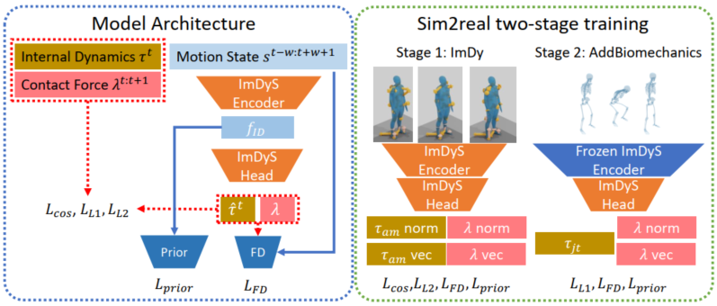

# [ImDy: Human Inverse Dynamics from Imitated Observations](https://foruck.github.io/ImDy/) (ICLR 2025) 

The code release is in progress.

## Environment Setup

Create a conda environment from `environment.yml`: `conda env create -f environment.yml`

## Data Acquisition

1. For data access, please get in touch with xinpengliu0907@gmail.com. 

The file structure should be 

```
- utils
- data
 |- raw_test
   |- grf.pkl
   |- pos.pkl
   |- rot.pkl
   |- torque.pkl
   |- weight.pkl
 |- raw_train
   |- ...
 |- nimble_test
   |- figure
     |- walking
   |- walking.pkl
- osim
 |- Geometry
   |- .....
 |- Rajagopal2015_passiveCal_hipAbdMoved_noArms.osim
 |- vtp_to_ply.py

- models
 |- containing SMPL models from https://smpl.is.tue.mpg.de
 |- containing Rajagopal2015 model without arm from https://addbiomechanics.org/download_data.html
- convert.py
- adb_motion_visualize.py
- main.py
- main_freeze.py
- dataset.py
- engine.py
```

2. Run ``python convert.py`` to convert the raw data into a different format with per-sample pickle files including axis-angle format SMPL parameters, joints, and markers. 
The torques stored are acquired by summing two consecutive torques in the simulation. 


## Checkpoint

You could download the checkpoints [here](https://drive.google.com/drive/folders/1kDr_UpdpE19efO99sp-oCInreX7o1CqY?usp=sharing). 


## Train

1. Run ``python main.py config_path=config/IDFD_mkr.yml USE_WANDB=True Timestamp=False`` to pre-train the ImDy model. In ``IDFD_mkr.yml``, you should modify the data path.
```
    joint_tor: true
    dpath: # your data path to imdy_train #
    cls_aug: false
......

    joint_tor: true
    dpath: # your data path to imdy_test #
    cls_aug: false
```

2. Run ``python main_freeze.py config_path=config/adb_mkr.yml USE_WANDB=True Timestamp=False`` to train the Addbiomechanics model. 

## Visualization


Run ``python adb_motion_visualize.py`` to visualize the motion from Addbiomechanics Dataset frame by frame.
In line 64, you could change the angles of camera to better visualize the motion.
```
scene.set_camera(angles=(-pi/8,pi/2+pi/4,0),distance=2.5) 
```


